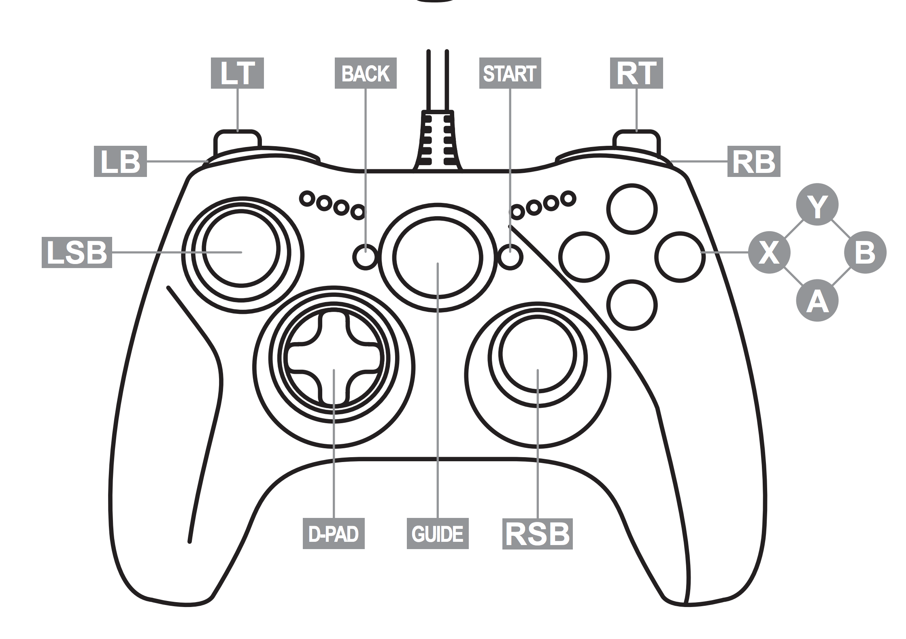

# Game Controls

*This document provides a concrete overview of different controls used by the game.*

| Action                | Keyboard Control    | Xbox Control     |
|-----------------------|---------------------|------------------|
| Accelerate            | W                   | RT               |
| Brake                 | S                   | LT               |
| Reverse               | Left shift          | LB               |
| Steer                 | A/D                 | LJS              |
| Toggle pause/menu     | ESC                 | START            |

*XBox controller diagram by [@palmerj](https://gist.github.com/palmerj) via [xbox_button_names](https://gist.github.com/palmerj/586375bcc5bc83ccdaf00c6f5f863e86) on GitHub Gist.*